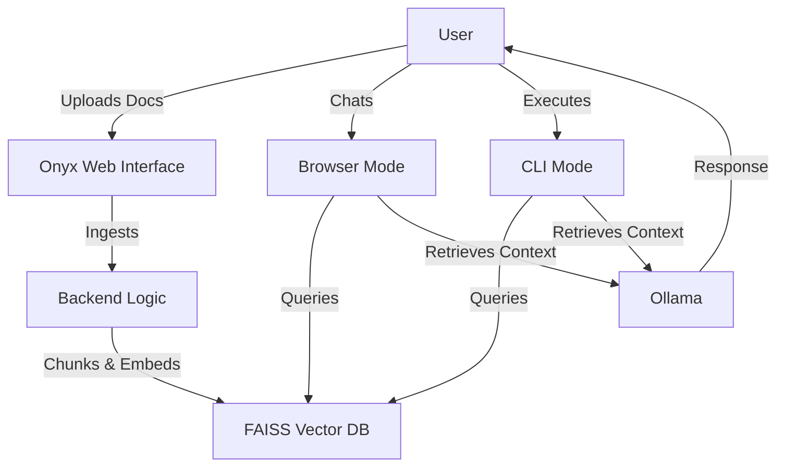

# 🖤 Onyx - Private AI Assistant


## 🚀 Overview
**Onyx** is a privacy-first, offline AI assistant designed for secure document analysis and intelligent conversations. Leveraging local Large Language Models (LLMs) via **Ollama**, Onyx ingests, indexes, and chats with your documents (PDF, DOCX, TXT, etc.) without a single byte leaving your machine.

> **Why Onyx?**  
> Built on the principle of absolute data sovereignty, Onyx ensures your sensitive documents never leave your device. Run powerful AI models locally with the sleek, dark interface you deserve.

## 🏗️ Architecture



## ✨ Features (v2.0.0 "Obsidian")

### 🔒 Privacy & Security
- **100% Offline & Private**: No API keys, no cloud costs, no data leaks
- **Local Processing**: All AI computations happen on your machine
- **Data Sovereignty**: You control your data, always

### 🎨 Premium Interface
- **Sleek Dark UI**: Beautiful gradient design with cyan-to-purple accents
- **Responsive Layout**: Adapts seamlessly to any screen size
- **Dual Mode Toggle**: Switch between Browser and CLI modes instantly

### 🧠 AI Capabilities
- **Multi-Model Support**: Switch between `gemma3:270m` (speed) and `qwen2.5:0.5b` (reasoning)
- **RAG-Powered**: Retrieval-Augmented Generation for accurate, context-aware responses
- **Document Intelligence**: Understands PDF, DOCX, TXT, CSV, Excel, and PowerPoint

### 📂 Document Management
- **Universal Ingestion**: Drag-and-drop file uploads
- **Smart Chunking**: Optimized text splitting for better retrieval
- **Vector Search**: Lightning-fast semantic search with FAISS

### 💬 Chat Features
- **Session Management**: Organize conversations with automatic saving
- **Bulk Operations**: Select and delete multiple chats at once
- **Toast Notifications**: Clear visual feedback for all actions
- **Custom Modals**: Reliable confirmation dialogs

## 📦 Installation

1. **Clone the repository**:
   ```bash
   git clone https://github.com/sumanthreddyaduri/Local-RAG-Agent.git
   cd Local-RAG-Agent
   ```

2. **Create a Virtual Environment** (Recommended):
   ```bash
   python -m venv venv
   # Windows
   venv\Scripts\activate
   # Mac/Linux
   source venv/bin/activate
   ```

3. **Install Dependencies**:
   ```bash
   pip install -r requirements.txt
   ```

4. **Install Ollama**:
   - Download from [ollama.com](https://ollama.com)
   - Pull the required models:
     ```bash
     ollama pull gemma3:270m
     ollama pull qwen2.5:0.5b
     ollama pull nomic-embed-text
     ```

5. **[Optional] Add Onyx to PATH** (to use `onyx` from anywhere):
   ```bash
   # Run interactive setup
   .\onyx setup
   
   # Follow the prompts, then close and reopen your terminal
   # Now you can use: onyx start (instead of .\onyx start)
   ```

## 🚀 Usage

**Unified Onyx Command:**
```bash
# Windows PowerShell (from project directory)
.\onyx          # Start Onyx (default)
.\onyx start    # Start Onyx (explicit)
.\onyx stop     # Stop Onyx
.\onyx status   # Check if Onyx is running

# Mac/Linux
./onyx          # Start Onyx
./onyx stop     # Stop Onyx (Ctrl+C also works)
./onyx status   # Check status

# Or use Python directly
python start_app.py
```

- **Web Interface**: Opens at `http://localhost:8501`
- **Browser Mode**: Chat with AI using web-based interface
- **CLI Mode**: Switch to terminal-based chat for distraction-free work

## 🛠️ Tech Stack
- **LangChain**: RAG orchestration and chains
- **FAISS**: High-performance local vector storage
- **Flask**: Lightweight web framework
- **Ollama**: Local LLM inference engine
- **Python 3.14**: Latest Python features

## 📝 Version History

### v2.0.0 "Obsidian" (Current)
- Complete rebrand to Onyx
- Bulk delete operations
- Custom confirmation modals
- CLI mode toggle switch
- Responsive header layout
- Toast notification system
- Performance improvements

See [ROADMAP](./ROADMAP.md) for future plans.

## 🤝 Contributing
Contributions are welcome! Please feel free to submit a Pull Request.

## 📄 License
This project is licensed under the MIT License.

## 🙏 Acknowledgments
Built with ❤️ using open-source AI technologies.

---

**Onyx v2.0.0** - Your data. Your AI. Your control.

