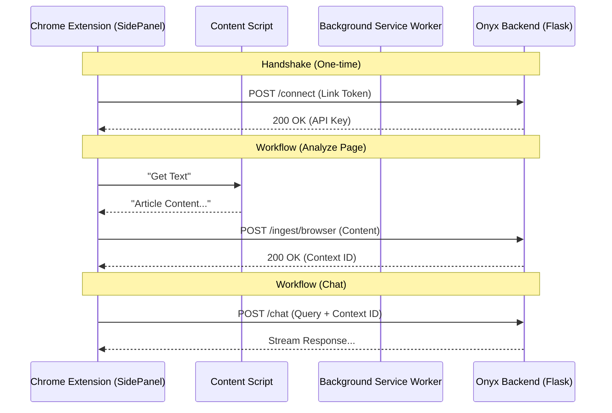

# v3.0 Browser Agent Integration Plan ("Phantom")

## 1. Vision & Overview
The **Onyx Browser Agent** transforms Onyx from a passive tailored RAG tool into an active browsing companion. Living in the Chrome Side Panel, it maintains a persistent connection to the local Onyx server, allowing users to:
1.  **Chat with Page**: Instantly RAG over the active tab's content without manual copy-pasting.
2.  **Summarize**: One-click distillation of long articles or PDFs.
3.  **Action (Phase 2)**: Execute tasks like "Fill this form with my shipping info".

## 2. Technical Architecture

### 2.1 High-Level Diagram


### 2.2 Core Components
1.  **Chrome Extension (Manifest V3)**
    *   **Scope**: Runs in browser, isolated origin `chrome-extension://<ID>`.
    *   **Responsibility**: UI rendering, capturing DOM, managing "Active Tab" permissions.
2.  **Onyx Server (Localhost)**
    *   **Scope**: Python Flask App running on `127.0.0.1:8501`.
    *   **Responsibility**: Vector storage, LLM inference, keeping "Browser Context" ephemeral.

## 3. Security & Authentication Model

### 3.1 The "Localhost Trust" Problem
Browsers sandbox extensions. They cannot arbitrarily talk to `localhost` unless:
1.  **CORS** is configured on the Server to allow the specific Extension ID.
2.  **Authentication** is present to prevent malicious websites from hitting the local API.

### 3.2 The Handshake Protocol
1.  **User Action**: User goes to Onyx Settings -> "Connect Extension".
2.  **Onyx Server**: Generates a 6-digit `LINK_TOKEN` (valid for 5 mins).
3.  **User Action**: Opens Extension, enters `LINK_TOKEN`.
4.  **Extension**: POSTs `LINK_TOKEN` to `/api/extension/verify`.
5.  **Onyx Server**: Validates token. If valid, generates a long-lived `EXTENSION_API_KEY` and returns it.
6.  **Extension**: Saves `EXTENSION_API_KEY` in `chrome.storage.local`.
7.  **Future Requests**: All requests include header `X-Onyx-Extension-Key: <KEY>`.

## 4. API Specification

### 4.1 Connection
*   `POST /api/extension/generate_token`
    *   **Response**: `{ "token": "123456", "expires_in": 300 }`
*   `POST /api/extension/verify`
    *   **Body**: `{ "token": "123456", "extension_id": "..." }`
    *   **Response**: `{ "api_key": "uuid-v4-..." }`

### 4.2 Ingestion
*   `POST /api/extension/ingest`
    *   **Headers**: `X-Onyx-Extension-Key: ...`
    *   **Body**: 
        ```json
        {
          "url": "https://example.com/article",
          "title": "Example Article",
          "content": "# Markdown extracted from DOM...",
          "html": "<div>Raw HTML optional...</div>"
        }
        ```
    *   **Response**: `{ "status": "success", "context_id": "ctx_123" }`

### 4.3 Chat & Session Sync
The Extension acts as a frontend for the main Onyx persistence layer. All chats are saved to `chat_history.db`.

*   `GET /api/extension/sessions`
    *   **Response**: List of recent sessions `{ id, name, last_updated }`.
*   `POST /api/chat` (Standard Endpoint)
    *   **Body**: `{ "message": "...", "session_id": 123, "browser_context_id": "ctx_..." }`
    *   **Effect**: 
        1.  Saves user message to DB (Session 123).
        2.  Saves AI response to DB (Session 123).
        3.  Updates "Last Updated" timestamp.
    *   **Logic**: If `browser_context_id` is present, the RAG chain prioritizes looking in the ephemeral vector store associated with that ID.

## 5. User Experience (UX) Flows

### 5.1 First-Time Setup (Onboarding)
*Trigger*: Extension installed but not connected.
*   **Display**: "Welcome to Onyx Browser Agent".
*   **Instructions**:
    1.  "Open your local Onyx Dashboard (localhost:8501)."
    2.  "Go to Settings > Connect Extension."
    3.  "Copy the Link Code and paste it here."
*   **Install Guide**: Use the `options.html` page to show detailed steps:
    *   "Go to `chrome://extensions`"
    *   "Enable Developer Mode"
    *   "Click 'Load Unpacked' -> Select `/local-rag-agent/chrome-extension` folder."

### 5.2 Home Screen (Default State)
*Trigger*: Extension opened, connected.
*   **Header**: "ONYX" (Branded Gradient).
*   **Subtext**: "Your Local Browser Agent."
*   **Main Action**: "Start New Chat" (Auto-selected).
*   **Welcome Message**: 
    > "Ready to analyze this page. Click 'Analyze' to read the content, or ask me anything."
*   **Sidebar Toggle**: 
    *   **Button**: `[ 🕒 History ]` (Top Left/Right).
    *   **Action**: Slides open the "Chat History" list.

### 5.3 Chat History View
*Trigger*: User clicks `[ 🕒 History ]`.
*   **List**: Scrollable list of previous sessions (synced from DB).
    *   Item: "Session Name" + "Date".
    *   Action: Clicking an item switches the view to that chat and loads history.
*   **Button**: `[ + New Chat ]` to return to the Home Screen state.

## 6. Extension Internal Structure

```text
/chrome-extension
├── manifest.json            # V3 Config (permissions: sidePanel, activeTab, storage)
├── /icons                   # 16, 48, 128px icons
├── /src
│   ├── background.js        # Service Worker (Handles CORS tweaks if strictly needed, connection state)
│   ├── content.js           # Injected script. Uses Readability.js to parse content.
│   ├── sidepanel.html       # Main UI Entry point
│   ├── sidepanel.js         # UI Logic (Vue.js or Vanilla)
│   └── lib
│       └── readability.js   # Mozilla's DOM parser
└── /styles
    └── sidepanel.css        # Tailwind or scoped CSS
```

## 6. Implementation Roadmap

### Phase 1: Foundation (The Scaffold)
*Objective: Get the side panel open and talking to Flask.*
- [ ] **Scaffold**: Initialize `chrome-extension/` with `manifest.json`.
- [ ] **Config**: Update `app.py` to accept `OPTIONS` requests (CORS preflight).
- [ ] **UI**: Create a "Hello World" side panel.
- [ ] **Test**: Verify `fetch('http://localhost:5000/api/health')` returns 200 from the extension.

### Phase 2: Security Handshake
*Objective: Secure the link.*
- [ ] **Backend**: Implement `generate_token` and `verify` endpoints.
- [ ] **Storage**: Implement `config.json` persistence for the generated API Key.
- [ ] **Frontend**: Build "Connect" UI in both Main App and Extension.

### Phase 3: The "Reader"
*Objective: Ingest content.*
- [ ] **Content Script**: Integrate `Readability.js` to strip ads/nav from pages.
- [ ] **Message Passing**: Send data `Content Script -> Side Panel -> Background -> Flask`.
- [ ] **Vector Store**: Create `EphemeralIndex` class in Onyx backend for temporary context.

### Phase 4: The Chat
*Objective: Chatting with the page.*
- [ ] **Chat UI**: Port the chat bubble interface to `sidepanel.html`.
- [ ] **RAG Integration**: Update `chat.py` to check for `browser_context_id`.

## 7. Development Guidelines
*   **No Build Step (Initially)**: Use ES Modules and native browser features to avoid complex Webpack/Vite configs unless necessary.
*   **Shared Styles**: Copy `main.css` variables to `sidepanel.css` to maintain visual consistency (Dark/Light themes).
*   **Error Handling**: Gracefully handle when the detailed Flask server is offline (show "Connect to Onyx" retry button).